# 🏬Hotel Project

In this project, I have taken a dataset from Kaggle (insert link) and divided it as follows:
After performing a brief EDA to understand the data, I have done customer segmentation using a K-Means algorithm, along with a Forecasting using XGBoost to predict future cancellations.
Below, we see the different sections explained briefly.

## 🤔 Parts of the project

1. Preprocessing Data (enlace)
2. EDA (enlace)
3. Clients Clustering, Cancelations Forecasting,  Augmented Dickey-Fuller Test (ADF) (enlace)

## ➡️PREPROCESSING DATA
After cleaning our data and see that we have all the information we need we notice that we will need to divide the main dataset in two as there are two properties involved in the same dataset, **Resort Hotel** and **City Hotel**.

As you can imagine, each property has different needs and therefore they should be treated differently.

## ➡️ EDA 
We have some useful information to get to know our data. For that we do the following charts to have a clearer vision of the important data:

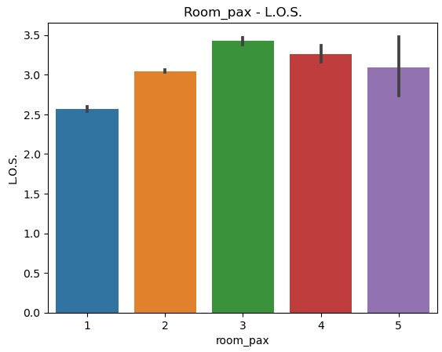

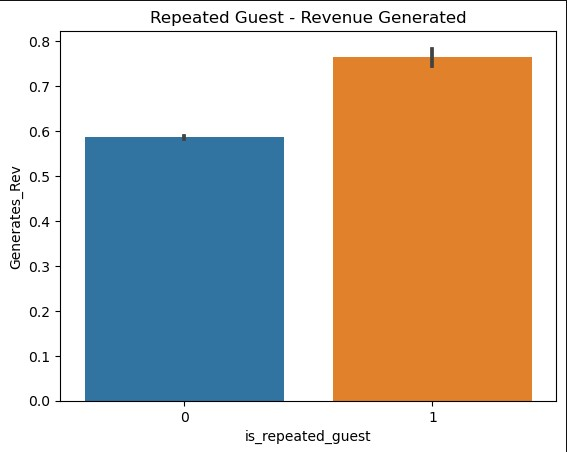

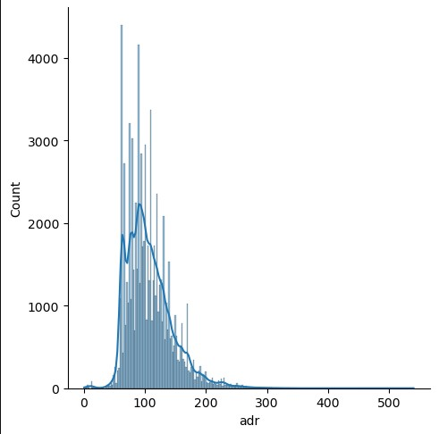

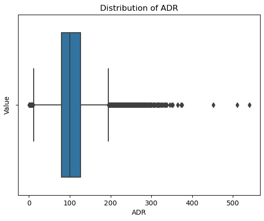

Having a column with ADRs categorized by types, where Type 2 represents the most common ADR, specifically between 60 and 140 (81%).

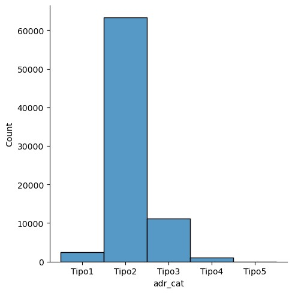

## 👨‍👩‍👦‍👦 Clients Clustering

After dividing our dataset for this City Hotel in 3 subsets (for 2 3 and 4 pax per room respectively) We do the following:

For clustering the clients of our dataset we will use a K-Means Algorythm, and for taht we need to get these plots in order to get the correct number of clusters:

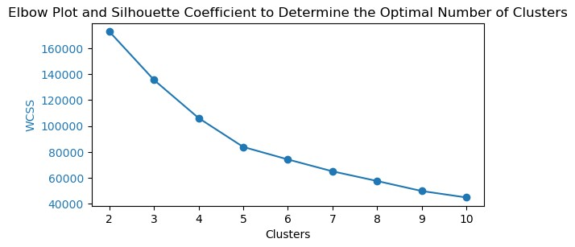

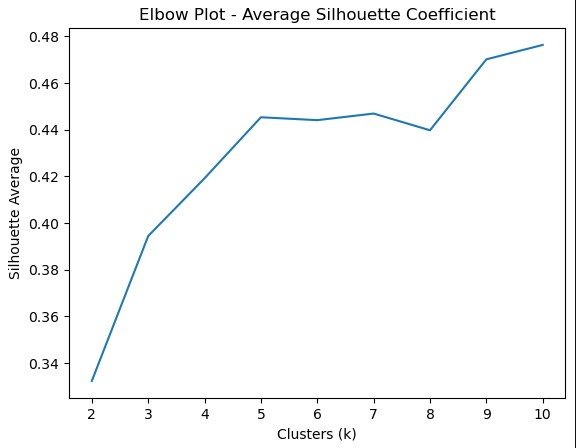

Based on the elbow plot, a value of k=4 appears to be most suitable for this analysis. At this point, the within-cluster sum of squares (WCSS) curve starts to flatten, indicating that adding more clusters does not significantly improve clustering. Additionally, the average silhouette coefficient reaches its maximum at k=4, indicating better separation between clusters and higher cohesion within them.

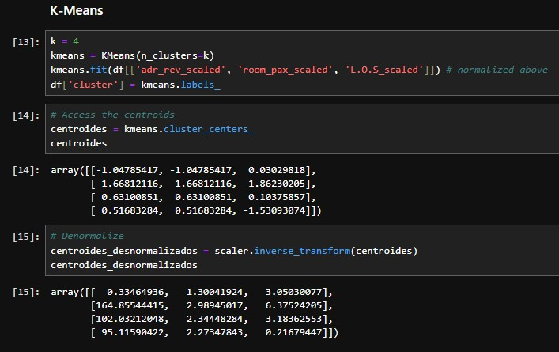

## 📈  PCA 

The goal of performing PCA is to reduce the dimensionality of the data and visualize it in a two-dimensional space. We have to take into account that the plot we have through the PCA gives us a mixed variables vision of the datset

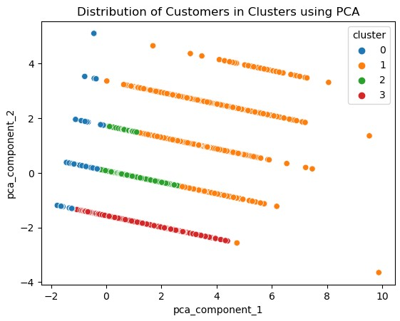

## ☎️ Cancelations Forecasting

Our target is to know if the reservations we will have will be canceled or not, so for getting that goal we will use a XGBoost Algorythm that we will train and test with our datset.

To train our algorythm we shuffle the samples randomly and get the first 30K rows, after that we define the best parameters and then fit the model and test it.

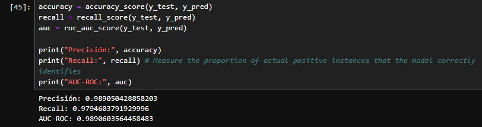

As we can see, 🎉🎉🎉we have very good results🎉🎉🎉, so, just to be sure, we test the model giving it samples where we already know that those reservations are cancelled and not cancelled respectively, and we see the model works perfectly.

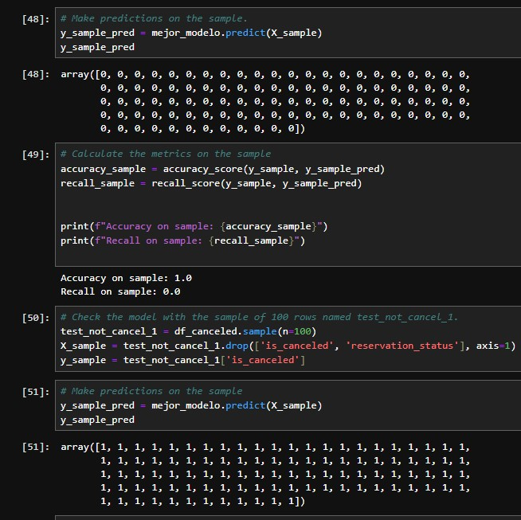
## 💉 Augmented Dickey-Fuller Test (ADF)
We perform the Augmented Dickey-Fuller Test (ADF) to determine if the time series data is stationary or not.¶

We have the following values:

For the df_2pax and df_3pax:

| Measurements  | df_2pax | df_3pax | df_4pax |
| ------------- |:-------------:|:-------------:|:-------------:|
| ADF Statistic      | -2.436760485815873    |-4.885927545083877    |-18.566594717638065    
| p-value      | 0.1316286357225247     |3.71420065828219e-05     |2.0846880228308853e-30    
| Stationary     | NO     |NO    |YES 

### With these results we could use ARIMA or ARIMAS for doing our predictions with the df_4pax as it is stationary 
